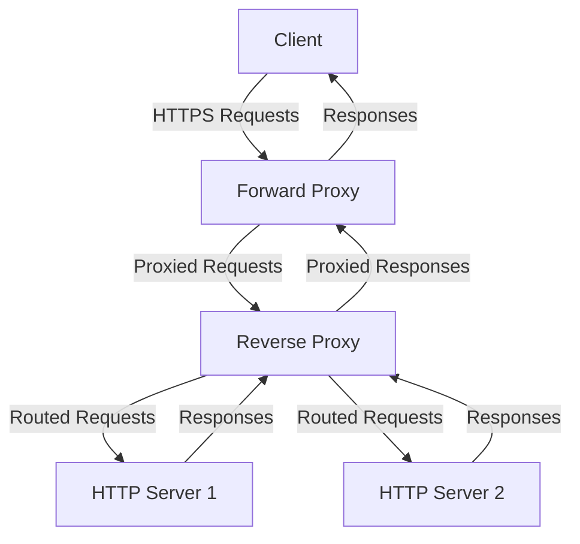
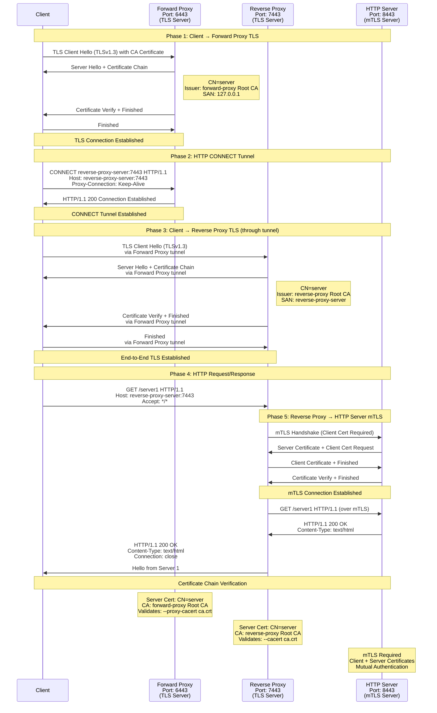

# HTTPProxySuite

**HTTPProxySuite** is a Go project demonstrating a full HTTP request flow using custom proxies and servers built with standard libraries.\
The suite includes:

1. **Forward Proxy** – receives client requests and forwards them to the reverse proxy.
2. **Reverse Proxy** – receives requests from the forward proxy and forwards them to the HTTP servers.
3. **HTTP Servers** – process requests and return responses back through the proxy chain.

This project showcases lightweight, end-to-end request handling, proxying, and server communication in Go, all without third-party frameworks.

### Highlevel Design


### TLS Communication Flow




---

## Project Structure

Only the key files are included below:

```
.
├── http-forward-proxy/
│   ├── main.go
│   └── Dockerfile
├── http-reverse-proxy/
│   ├── main.go
│   └── Dockerfile
├── http-server/
│   ├── main.go
│   ├── index_server_1.html
│   └── index_server_2.html
├── docker-compose.yml
└── README.md
```

- `http-forward-proxy/` – contains the forward proxy server main code and Dockerfile.
- `http-reverse-proxy/` – contains the reverse proxy main code and Dockerfile.
- `http-server/` – contains the HTTP server code and key index files.
- `docker-compose.yml` – orchestrates the containers and networks.

---

## Requirements

- [Docker](https://www.docker.com/get-started) >= 20.x
- [Docker Compose](https://docs.docker.com/compose/) >= 1.29.x
- Go >= 1.20 (for building the binaries)

---

## Setup & Running

### 1. Build and start all services

```bash
docker-compose up --build -d
```

### 2. Verify the services

```bash
docker ps
```

---

## Reverse Proxy Mapping

The reverse proxy mappings can be configured via the `-map` argument in the format:

```
<context_path>=<host>:<port>
```

Example in `docker-compose.yml`:

```yaml
command: ["./reverse-proxy-server", "-host", "0.0.0.0", "-port", "7090", "-map", "/server1=http-server-1:8081,/server2=http-server-2:8082"]
```

---

## Usage Examples

Server 1:

```bash
curl -v -x http://127.0.0.1:6790 http://reverse-proxy-server:7090/server1
curl -v -x https://127.0.0.1:6443 --proxy-cacert ca.crt http://reverse-proxy-server:7090/server1
```

Server 2:

```bash
curl -v -x http://127.0.0.1:6790 http://reverse-proxy-server:7090/server2
```

---

## Customizing Index Pages

- `http-server/index_server_1.html` → served by `http-server-1`
- `http-server/index_server_2.html` → served by `http-server-2`

---

## Networks

- `internal-net` – for reverse proxy and HTTP servers.
- `public-net` – exposed network for forward proxy.

---

## Stopping & Removing Containers

```bash
docker-compose down
```

---

## Notes

- Forward proxy can route requests to any reverse proxy.
- Reverse proxy mapping can be updated via `-map` argument.
- HTTP servers listen on all interfaces for container communication.

---

## License

Specify your license here (e.g., MIT, Apache 2.0).